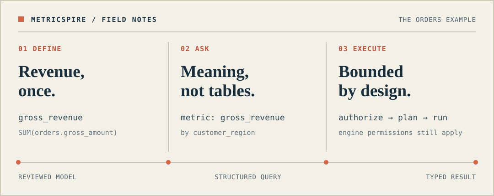

<p align="center"></p>

<h1 align="center">MetricSpire</h1>

<p align="center"><strong>问指标，不问物理表。</strong></p>

<p align="center">经过评审的定义 · 有边界的查询 · UI、API 与 MCP 共用一套契约</p>

<p align="center"><a href="README.md">English</a> · <strong>简体中文</strong> · <a href="README.ja.md">日本語</a></p>

<p align="center"></p>

<p align="center"><sub>基于仓库公开的 <code>orders</code> 模型绘制；并非产品截图，也不代表实时查询结果。</sub></p>

<p align="center"><a href="docs/getting-started.md">体验公开示例</a> · <a href="docs/mcp.md">连接 AI 客户端</a> · <a href="docs/architecture.md">了解架构</a></p>

MetricSpire 是开源的语义指标服务。经评审的指标定义发布一次，应用与 AI Agent 就能按指标 code 和维度使用同一套治理链路。服务解析生效版本，执行策略与限额检查；真实数据的访问权仍由分析引擎裁定。

> **开发预览版，尚非生产就绪。** Databricks Apps staging 路径经过验证，但计划中的 `v0.1.0` 尚未发布。[查看已验证范围](docs/development-status.md)（英文）。

## 为什么做 MetricSpire

调用方提交**指标 code 与维度**，不自行选择物理表或生成不受约束的 SQL。MetricSpire 管理业务定义、经过审核的物理绑定、生效版本、产品权限与查询限额；底层分析引擎仍负责判断真实用户能否读取数据。

它是指标服务，不代替数据仓库、BI 系统，也不会绕过引擎原生的行列权限。

## 已实现的能力

- **受治理的目录：** PostgreSQL 保存带乐观版本控制的草稿、校验结果、不可变的 `trial`/`certified` 发布、生效或撤下状态、回滚及版本事件。
- **可移植的语义：** 使用受约束的表达式和逻辑计划；环境相关的表与字段映射由经过评审的 `SourceBinding` 管理，不接受调用方传入原始 SQL。
- **受控执行：** 查询前检查策略与引擎能力；Databricks SQL 适配器使用参数化语句、超时、取消、类型化结果、行数与字节限制，以及失败即关闭的审计。
- **三个入口、一套服务：** 维护与查询界面、严格的 HTTP 管理/查询 API，以及七个远程 MCP 查询工具共用应用服务。
- **清晰的身份边界：** 自托管可选通用 OIDC；Databricks Apps 使用平台托管身份。产品权限不能覆盖仓库原生的数据权限。

Databricks SQL 是首个分析引擎适配器；目前不宣称已支持多引擎执行。PostgreSQL 是事务性**控制面**，不保存分析事实或查询结果。详细边界见[架构](docs/architecture.md)与 [HTTP 契约](docs/http-api.md)（英文）。

## 试用语义规划

需要 Go 1.26 或 1.27。下面的离线示例编译中立的订单模型并生成计划，无需数据库，也不会向 Warehouse 提交查询。

```bash
mkdir -p dist/demo
go run ./cmd/metricspire compile \
  --source examples/orders/model.yaml \
  --out dist/demo/manifest.json
go run ./cmd/metricspire compile-policy \
  --source examples/orders/policy.yaml \
  --manifest dist/demo/manifest.json \
  --out dist/demo/policy-bundle.json
go run ./cmd/metricspire plan \
  --manifest dist/demo/manifest.json \
  --policy dist/demo/policy-bundle.json \
  --context examples/orders/context.json \
  --query examples/orders/query.json \
  --binding examples/orders/binding.json \
  --capabilities examples/orders/capabilities.json \
  --logical-out dist/demo/logical-plan.json \
  --physical-out dist/demo/physical-plan.json
```

示例中的 context 文件**仅在离线演示中**被信任；网络调用方不能自行指定身份、策略、绑定、发布版本、引擎或 SQL。本地 PostgreSQL 发布、服务启动与验证命令见[快速上手](docs/getting-started.md)（英文）。

## 连接 AI 客户端

部署后的实例通过 `/api/v1/mcp` 提供 Streamable HTTP MCP（Databricks Apps 推荐此路径）。客户端只需连接 URL，不必克隆仓库或在本地运行 MetricSpire。工具支持发现、解释、规划、受限查询提交、状态读取与取消；**不**提供原始 SQL 或发布操作。

```text
list_namespaces → search_metrics → explain_query → plan_query
               → submit_query → get_query / cancel_query
```

每次请求都会独立鉴权。Databricks Apps 部署需要预注册公共 OAuth 客户端，用户还需具备自己的 App 与数据权限；浏览器登录成功本身不等于查询验收。客户端配置、工具行为与安全边界见 [MCP 接入](docs/mcp.md)，当前验收范围见[开发状态](docs/development-status.md)（英文）。

## 文档导航

| 文档（英文） | 内容 |
| --- | --- |
| [快速上手](docs/getting-started.md) | 离线规划、本地目录流程、服务配置与验证。 |
| [MCP 接入](docs/mcp.md) | 远程工具、OAuth 客户端配置及作业边界。 |
| [架构](docs/architecture.md) | 语义、身份、控制面与引擎适配器边界。 |
| [HTTP 契约](docs/http-api.md) | 端点、权限、错误、限额及审计行为。 |
| [开发状态](docs/development-status.md) | 预览版验收边界、未完成项与发布门槛。 |
| [贡献指南](CONTRIBUTING.md) | 分支、PR、测试、迁移与数据安全规范。 |

[文档索引](docs/README.md)区分对外指南和维护者专用的 staging 部署说明；阶段验收记录仅在本地保留，不混入公开产品文档。

机器可读的语义契约是 [`metricspire.io/v1alpha1`](contracts/metricspire.schema.json)；其版本与计划中的产品 `v0.1.0` 独立演进。

## 范围与许可

MetricSpire 不负责 ETL、不托管 LLM、不开放任意 SQL、不导出海量结果，也不执行跨引擎 Join。不支持的计划会在执行前失败，而非悄悄改变语义。

采用 [Apache 2.0](LICENSE) 许可。项目为独立的 clean-room 实现，示例采用中立的公开数据；请勿提交凭据、私有业务 Schema 或生产数据。
